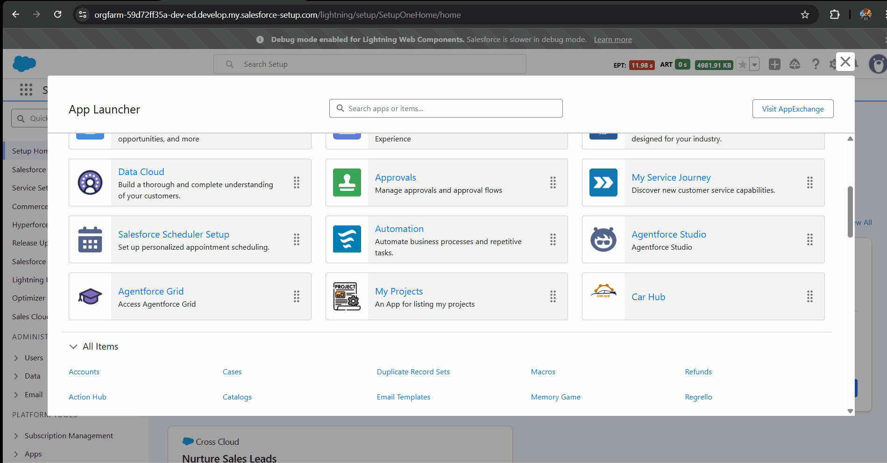
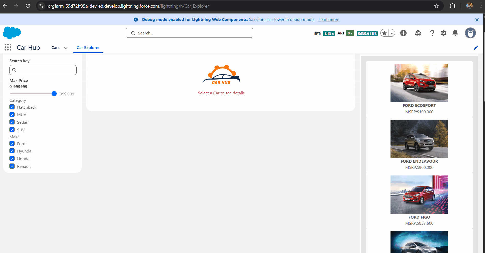
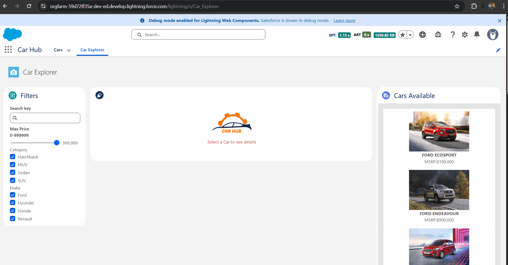
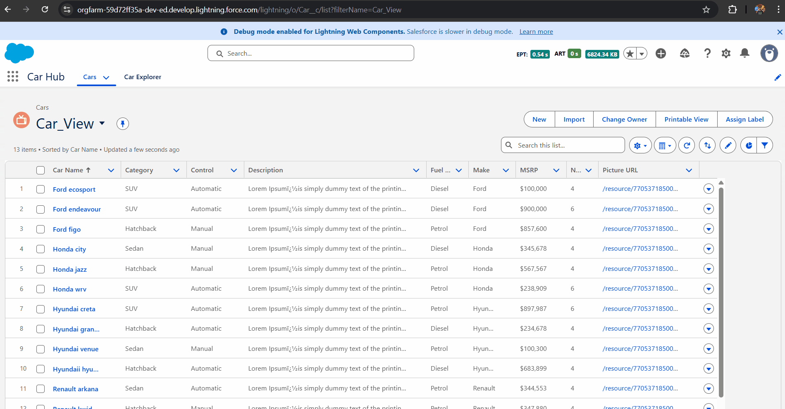
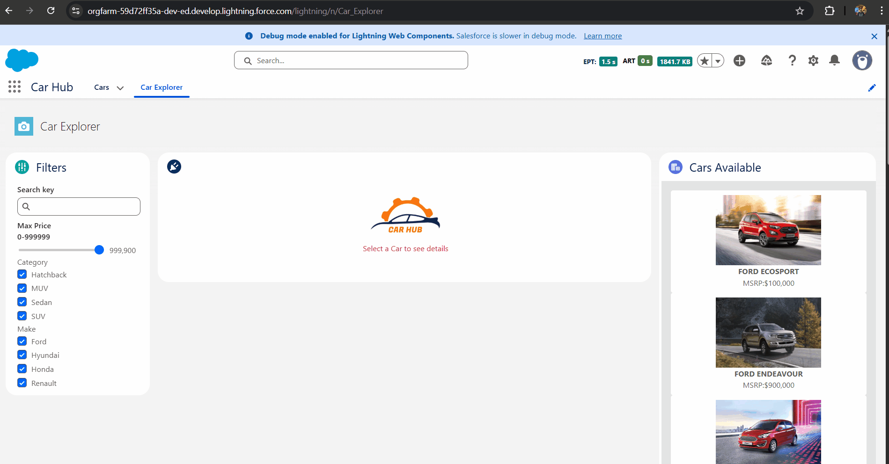

# 🚗 Car Hub Project (LWC)

A comprehensive Car Showroom Management application built on the Salesforce Platform. This project leverages **Lightning Web Components (LWC)** to create a rich, interactive "Car Explorer" dashboard that allows users to browse, filter, and view vehicle details dynamically using a Master-Detail interface.

## 📸 Application Gallery

| **App Launcher Integration** | **Car Explorer Dashboard** |
|:---:|:---:|
|  |  |
| *Custom App configuration accessible via the Salesforce App Launcher.* | *The main interface featuring a filter sidebar, a central detail placeholder, and a scrollable vehicle list.* |

### 🔍 Dynamic Filtering Capabilities

| **Filter by Make** | **Filter by Category** | **Filter by Price**| **Search by Key** |
|:---:|:---:|:---:|:---:|
|  |  | | |
| *Real-time list updates when selecting specific manufacturers (e.g., Ford, Hyundai).* | *Filtering vehicles by body type (SUV, Sedan, Hatchback).* | *Filtering vehicles by price.* | *Car Search by key* |

### Other Screenshots
|**Car View Details** | **Car Details** |
|:---:|:---:|
|  |  |

## ✨ Key Features

### 1. Advanced Car Explorer (LWC)
A custom Lightning Page designed with a three-column layout (Sidebar, Main Content, Side List) for an optimal browsing experience.
-   **Multi-Criteria Filtering:** Users can refine their search using multiple parameters simultaneously:
    -   **Text Search:** Keyword search for model names.
    -   **Price Slider:** A dynamic range slider to filter cars by Maximum Price (MSRP).
    -   **Category Checkboxes:** Filter by body styles (SUV, Sedan, Hatchback, MUV).
    -   **Make Checkboxes:** Filter by specific manufacturers.
-   **Reactive List View:** The "Cars Available" list on the right side updates instantly via Apex calls as filters are adjusted.

### 2. Master-Detail Interaction
-   **Selection Handling:** Clicking on a car tile in the right-hand list selects the vehicle.
-   **Detail View:** The center panel (initially showing a placeholder) dynamically renders the full details of the selected car, including high-resolution images and specifications.

### 3. Data Management
-   **Custom Object (`Car__c`):** Built on a robust data model to store vehicle information including Fuel Type, Seat Capacity, MSRP, and Picture URLs.
-   **Standard List Views:** Includes configured standard Salesforce List Views for backend data entry and bulk management.

### 4. Component Communication
-   Uses **Lightning Message Service (LMS)** or Custom Events to facilitate seamless communication between the Filter Component (Left), the Tile List Component (Right), and the Detail Component (Center).

## 🛠️ Architecture & Tech Stack

-   **Frontend:** Lightning Web Components (LWC), SLDS Grid System.
-   **Backend:** Apex Controllers (SOQL with dynamic `WHERE` clauses).
-   **Data Model:**
    -   **Object:** `Car__c`
    -   **Fields:** `Name`, `Category__c`, `Make__c`, `MSRP__c`, `Fuel_Type__c`, `Picture_URL__c`, `Description__c`.
-   **Styling:** Salesforce Lightning Design System (SLDS) for responsive cards and form elements.

## 🚀 Installation & Usage

### Prerequisites
-   Salesforce DX project set up.
-   VS Code with Salesforce Extension Pack.
-   Authorized Dev Hub or Scratch Org.

### Deployment Steps

1.  **Clone the Repository:**
    ```bash
    git clone [https://github.com/gayanandpatel/Salesforce-Project-LWC-Apex-.git](https://github.com/gayanandpatel/Salesforce-Project-LWC-Apex-.git)
    cd Salesforce-Project-LWC-Apex-
    ```

2.  **Authorize your Org:**
    ```bash
    sfdx auth:web:login -d -a myDevOrg
    ```

3.  **Deploy Source to Org:**
    Right-click on the `Car Hub Project` folder in VS Code and select **SFDX: Deploy Source to Org**.
    *Or run via CLI:*
    ```bash
    sfdx force:source:deploy -p "Car Hub Project" -u myDevOrg
    ```

4.  **Assign Permissions:**
    Ensure the `Car Hub` permission set (if included) or profile access is granted for the `Car__c` object and the Custom Tab.

5.  **Import Dummy Data:**
    Use the Data Import Wizard or `sfdx force:data:tree:import` if a data plan is provided to populate the `Car__c` object with sample vehicles.

6.  **Access the App:**
    Open the **App Launcher**, search for **"Car Hub"**, and enjoy the experience!

## 📂 Project Structure

```text
Car Hub Project/
├── classes/               # CarController.cls (Handles search logic)
├── lwc/
│   ├── carFilter/         # Left Sidebar (Search, Slider, Checkboxes)
│   ├── carTile/           # Individual Car Card component
│   ├── carTileList/       # Right Sidebar (Grid of Car Tiles)
│   ├── carDetail/         # Center Component (Selected Car Info)
│   └── carExplorer/       # Container Component holding the layout
└── objects/               # Car__c Custom Object definition
```
---
## 👤 Author
**Gayanand Patel**