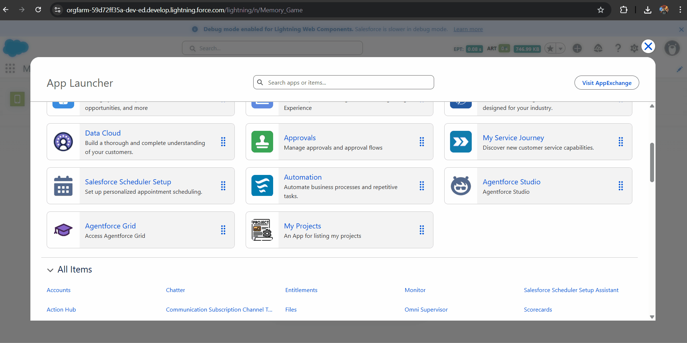
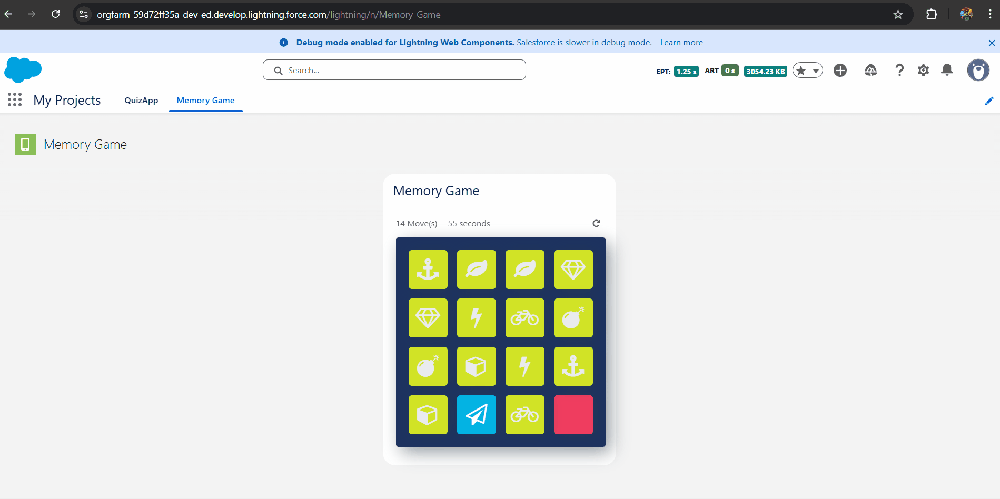

# 🧠 Memory Game (LWC)

A classic interactive card matching game built on the Salesforce Platform using **Lightning Web Components (LWC)**. This project demonstrates complex DOM manipulation, state management, and game logic implementation within the Salesforce ecosystem.

## 📸 Screenshots

| **App Launcher Integration** | **Game Interface** |
|:---:|:---:|
|  |  |
| *Accessible directly from the Salesforce App Launcher.* | *The gameplay interface showing the card grid, move counter, and timer.* |

## ✨ Features

-   **Interactive Card Grid:** A 4x4 grid (16 cards) that handles click events to reveal hidden icons.
-   **Matching Logic:** Automatically detects pairs.
    -   **Match:** Cards remain revealed and are visually highlighted.
    -   **Mismatch:** Cards flip back over after a short delay (unmatched animation).
-   **Performance Tracking:**
    -   **Move Counter:** Tracks the number of flips/attempts made by the user.
    -   **Timer:** A real-time clock that starts on the first click to measure game duration.
-   **Game State Management:**
    -   **Restart Functionality:** A refresh button allows the user to reset the timer, moves, and reshuffle the cards without reloading the page.
    -   **Completion Check:** Detects when all pairs are found to conclude the game.
-   **Responsive Design:** Uses **Salesforce Lightning Design System (SLDS)** grid classes to ensure the game board looks good on different screen sizes.
-   **Custom Styling:** Animations for card flipping and distinct visual cues for matched/unmatched states.

## 🛠️ Tech Stack

-   **Frontend:** Lightning Web Components (LWC), HTML, CSS (Custom animations), JavaScript (Game logic).
-   **Styling:** Salesforce Lightning Design System (SLDS) & Custom CSS.
-   **Icons:** Font Awesome (or similar icon library) integration for card symbols.
-   **Tools:** VS Code, Salesforce CLI (SFDX), Git.

## 🚀 Installation & Usage

### Prerequisites
-   Salesforce DX project set up.
-   VS Code with Salesforce Extension Pack.
-   Authorized Dev Hub or Scratch Org.

### Deployment Steps

1.  **Clone the Repository:**
    ```bash
    git clone [https://github.com/gayanandpatel/Salesforce-Project-LWC-Apex-.git](https://github.com/gayanandpatel/Salesforce-Project-LWC-Apex-.git)
    cd Salesforce-Project-LWC-Apex-
    ```

2.  **Authorize your Org:**
    ```bash
    sfdx auth:web:login -d -a myDevOrg
    ```

3.  **Deploy Source to Org:**
    Right-click on the `Memory Game` folder in VS Code and select **SFDX: Deploy Source to Org**.
    *Or run via CLI:*
    ```bash
    sfdx force:source:deploy -p "Memory Game" -u myDevOrg
    ```

4.  **Add Static Resources (If applicable):**
    If the project uses an external library (like Font Awesome) stored in Static Resources, ensure that is deployed first.

5.  **Add to Page:**
    -   Go to **Setup > Lightning App Builder**.
    -   Edit an existing App Page or create a new one.
    -   Drag and drop the `MemoryGame` component onto the canvas.
    -   Save and Activate.

6.  **Access the App:**
    Open the **App Launcher** (9 dots), search for **"Memory Game"** or **"My Projects"**, and launch the application.

## 📂 Project Structure

```text
Memory Game/
├── classes/               # (Optional) Apex Controllers if saving high scores
├── lwc/
│   ├── memoryGame/        # Main Game Component
│   │   ├── memoryGame.html
│   │   ├── memoryGame.js  # Core Game Logic (Timer, Shuffle, Match check)
│   │   ├── memoryGame.css # Card Flip Animations
│   │   └── memoryGame.js-meta.xml
└── tabs/                  # Custom Tab definition
```
---
## 👤 Author
**Gayanand Patel**