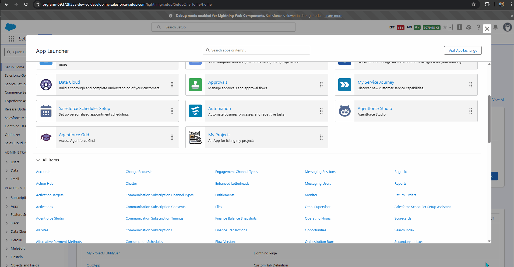
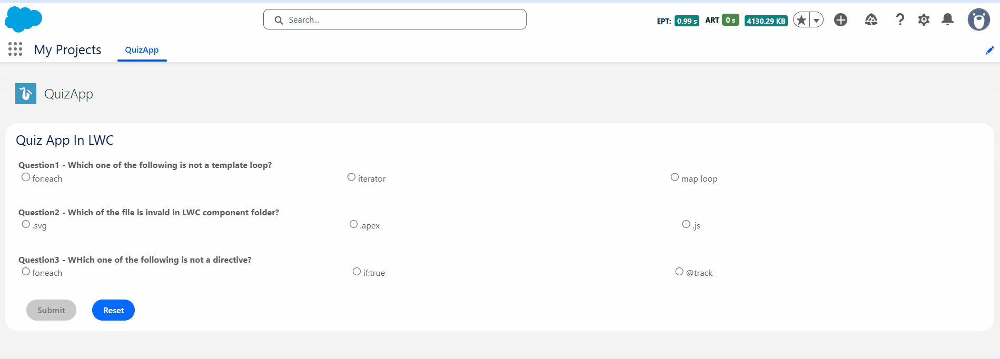

# 📝 Salesforce Quiz App (LWC)

A dynamic and interactive Quiz Application built on the Salesforce Platform using **Lightning Web Components (LWC)** and **Apex**. This project is designed to test users' knowledge of Salesforce development concepts (specifically LWC) through a modern, responsive user interface.

## 📸 Screenshots

| **App Launcher Integration** | **Quiz Interface** |
|:---:|:---:|
|  |  |
| *Accessible directly from the Salesforce App Launcher under "My Projects".* | *Interactive quiz with radio button selection, submit, and reset functionality.* |

## ✨ Features

-   **Dynamic Question Rendering:** Automatically renders questions and multiple-choice options (radio buttons) from a data set.
-   **Selection Handling:** Captures user input in real-time, ensuring only one option can be selected per question.
-   **Score Calculation:** The "Submit" feature evaluates user answers against the correct key and displays the final score.
-   **State Management:**
    -   **Reset Functionality:** Clears all user selections and resets the quiz state to its initial default without reloading the page.
    -   **Validation:** Prevents submission until valid selections are made (if configured) or highlights correct/incorrect answers.
-   **Responsive Design:** Styled with **Salesforce Lightning Design System (SLDS)** for a native look and feel.
-   **App Page Integration:** Fully compatible with Lightning App Builder; deployed as a custom tab within the "My Projects" app.

## 🛠️ Tech Stack

-   **Frontend:** Lightning Web Components (LWC), HTML, CSS, JavaScript (ES6+).
-   **Backend:** Apex (Controllers for data fetching/logic), SOQL.
-   **Styling:** Salesforce Lightning Design System (SLDS).
-   **Tools:** VS Code, Salesforce CLI (SFDX), Git.

## 🚀 Installation & Usage

### Prerequisites
-   Salesforce DX project set up.
-   VS Code with Salesforce Extension Pack.
-   Authorized Dev Hub or Scratch Org.

### Deployment Steps

1.  **Clone the Repository:**
    ```bash
    git clone [https://github.com/gayanandpatel/Salesforce-Project-LWC-Apex-.git](https://github.com/gayanandpatel/Salesforce-Project-LWC-Apex-.git)
    cd Salesforce-Project-LWC-Apex-
    ```

2.  **Authorize your Org:**
    ```bash
    sfdx auth:web:login -d -a myDevOrg
    ```

3.  **Deploy Source to Org:**
    Right-click on the `Quiz App` folder (or `force-app`) in VS Code and select **SFDX: Deploy Source to Org**.
    *Or run via CLI:*
    ```bash
    sfdx force:source:deploy -p "Quiz App" -u myDevOrg
    ```

4.  **Assign Permissions:**
    Ensure your user has the necessary permissions to access the Apex classes and the Custom Tab.

5.  **Add to Page:**
    -   Go to **Setup > Lightning App Builder**.
    -   Edit an existing App Page or create a new one.
    -   Drag and drop the `QuizApp` custom component onto the canvas.
    -   Save and Activate.

6.  **Access the App:**
    Open the **App Launcher** (9 dots), search for **"QuizApp"** or **"My Projects"**, and launch the application.

## 📂 Project Structure

```text
Quiz App/
├── classes/               # Apex Controllers (backend logic)
├── lwc/
│   ├── quizApp/           # Main LWC Component
│   │   ├── quizApp.html   # Template (Questions UI)
│   │   ├── quizApp.js     # Controller (Handlers for Submit/Reset)
│   │   ├── quizApp.css    # Custom Styling
│   │   └── quizApp.js-meta.xml # Configuration for App Builder
└── tabs/                  # Custom Tab definition
```
---

## 👤 Author
**Gayanand Patel**